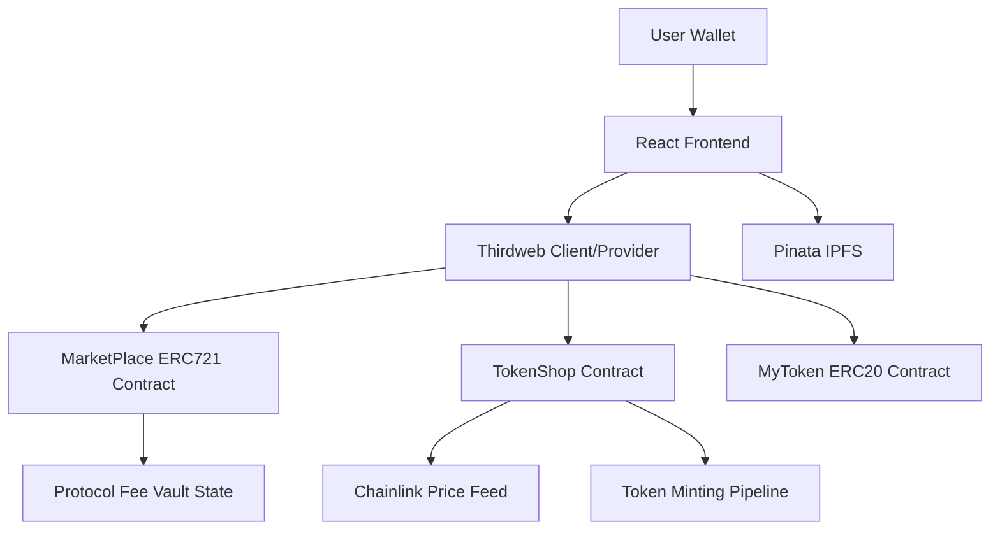
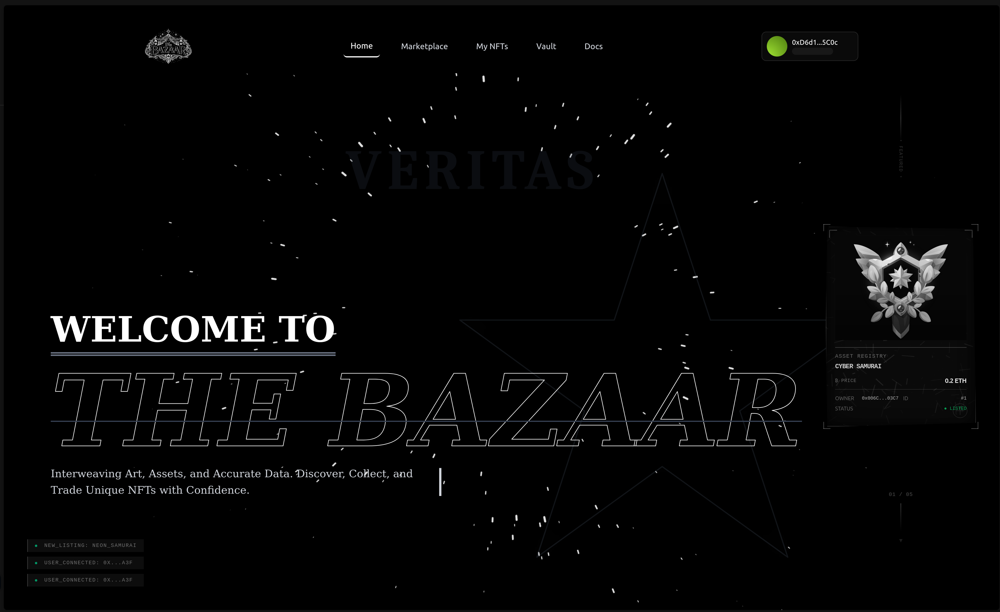
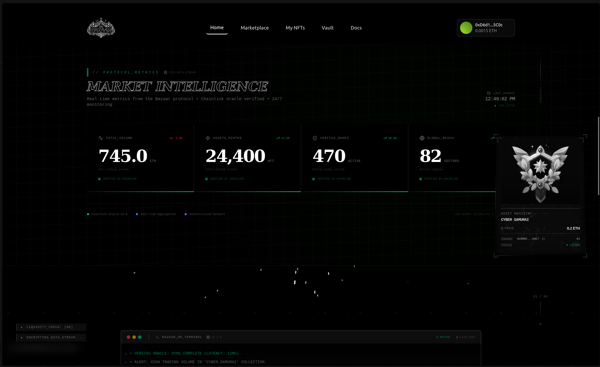
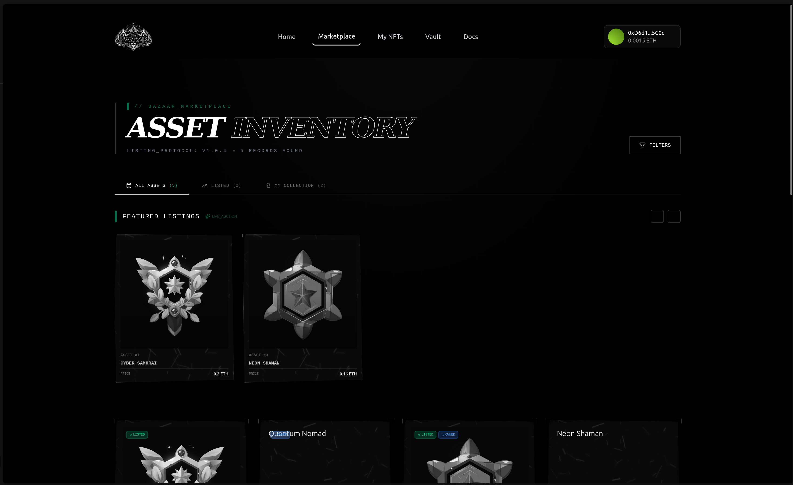
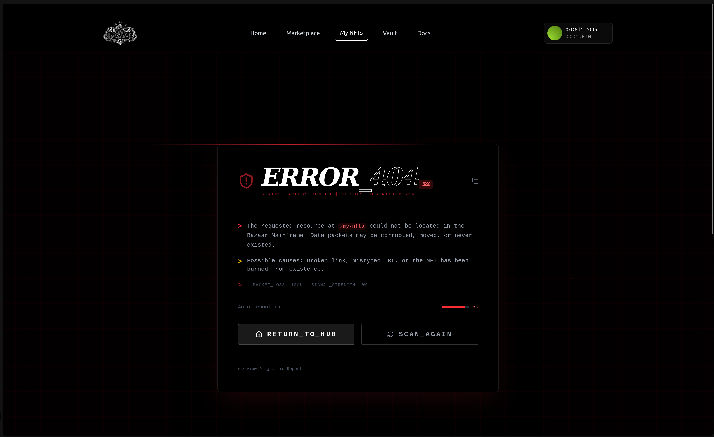

# The Bazaar

The Bazaar is a full-stack Web3 marketplace where users can mint, list, buy, and manage on-chain NFT assets while interacting with a protocol-native ERC20 economy.

It combines:

- A custom ERC721 marketplace contract for asset lifecycle and fee collection
- A custom ERC20 token with role-based mint permissions
- A token shop that mints protocol tokens from ETH using Chainlink ETH/USD pricing
- A modern React + Vite frontend powered by Thirdweb wallet and contract interactions
- Runtime-configurable Docker deployment for immutable frontend builds with dynamic environment injection

## Table of Contents

- [Audience Snapshots](#audience-snapshots)
- [Why The Bazaar Exists](#why-the-bazaar-exists)
- [Core Product Surfaces](#core-product-surfaces)
- [Tech Stack](#tech-stack)
- [Architecture Design](#architecture-design)
- [Project Structure](#project-structure)
- [Screenshots](#screenshots)
- [Quick Start (Local)](#quick-start-local)
- [Environment Variables](#environment-variables)
- [Contract Workflow](#contract-workflow)
- [Testing](#testing)
- [Docker Workflow](#docker-workflow)
- [Security Notes](#security-notes)
- [Known Limits and Design Tradeoffs](#known-limits-and-design-tradeoffs)
- [Troubleshooting](#troubleshooting)
- [Roadmap Ideas](#roadmap-ideas)
- [License](#license)

## Audience Snapshots

For builders:

- The Bazaar is a composable Web3 application template that connects ERC721 asset flows, ERC20 tokenomics, and oracle-backed pricing in one codebase.
- It is built to be hacked on quickly: contract scripts, tests, React contexts, and Docker runtime config are already wired.

For hackathon judges:

- This project demonstrates real protocol composition, not only UI polish: mint/list/trade, fee accounting, oracle usage, and treasury controls are connected end-to-end.
- It includes both user paths (market actions) and operator paths (vault controls), which gives a fuller product narrative than a standalone dApp demo.

For ecosystem partners and reviewers:

- The architecture is chain-ready and modular: contracts are separated by domain responsibility, while the frontend uses provider-based context boundaries.
- The deployment model supports reproducible local dev and production-like container execution with runtime env injection.

## Why The Bazaar Exists

Most NFT marketplaces stop at mint/list/buy and treat token economics as an afterthought.

The Bazaar is built as a protocol playground where:

- assets (ERC721),
- utility currency (ERC20), and
- oracle-priced token access (Chainlink-powered Token Shop)

are intentionally connected in one coherent product.

The end goal is not just to display NFTs, but to model a market system with tokenized incentives, fee mechanics, and admin observability.

## Core Product Surfaces

1. Marketplace

- Mint NFT assets with metadata URI
- List and delist owned NFTs
- Buy listed NFTs with ETH
- Track ownership and previous owners
- Collect protocol listing fees in contract balance

2. Vault

- Read owner and reserve balance from the marketplace contract
- Restrict withdrawal action to marketplace owner
- Provide an operator-facing protocol treasury UI

3. Token Shop

- Buy protocol ERC20 tokens by sending ETH directly to the shop contract
- Mint amount derived from Chainlink ETH/USD feed and fixed token USD price
- Register token->price feed mappings for token-to-token swaps

4. Docs Surface

- Markdown-driven in-app docs pages under src/content/docs

## Tech Stack

- Smart Contracts: Solidity 0.8.24
- Contract Tooling: Hardhat, hardhat-toolbox
- Standards/Libraries: OpenZeppelin, Chainlink AggregatorV3
- Frontend: React 19, Vite 8, React Router 7
- Web3 SDK: Thirdweb v5
- UI/Motion: Tailwind CSS v4, Framer Motion, Lucide Icons
- Storage/Metadata: Pinata IPFS APIs
- Containerization: Docker + Docker Compose + Nginx runtime env injection

## Architecture Design

### System View



### Layered Design

1. Presentation Layer

- React + Vite pages for Home, Marketplace, Vault, and Docs.
- Wallet state and transaction UX are surfaced in the UI with toasts and loading states.

2. Application Layer

- Context providers isolate domain logic:
  - MarketPlace provider for NFT flows.
  - Token provider for ERC20 reads/writes.
  - TokenShop provider for ETH->token purchases and swaps.
- This layer transforms user intent into contract calls and normalizes errors for UI display.

3. Protocol Layer

- MarketPlace contract handles NFT mint/list/delist/buy and fee accounting.
- MyToken contract handles ERC20 supply logic with role-based minting.
- TokenShop contract handles oracle-priced minting and token swap quoting.

4. Data and Oracle Layer

- Chainlink ETH/USD feed secures conversion for ETH->MTK mint amounts.
- Pinata stores off-chain asset files and metadata payloads used by tokenURI.

### Contract Interaction Boundaries

1. MarketPlace contract

- Responsibility: NFT lifecycle and marketplace settlement.
- Inputs: metadata URI, listing intent, buy value in ETH.
- Outputs: ownership transitions, listing state, fee accumulation.

2. MyToken contract

- Responsibility: fungible utility token supply.
- Inputs: mint/burn requests from authorized roles.
- Outputs: ERC20 balance and supply state updates.

3. TokenShop contract

- Responsibility: ETH-to-token exchange and token swap quoting.
- Inputs: ETH via receive(), configured token feeds, swap requests.
- Outputs: minted tokens, swap transfers, owner-withdrawable ETH balance.

### Runtime Configuration Model

- In browser dev mode, config is read from import.meta.env.
- In containerized production, config is injected at startup into window.**BAZAAR_ENV**.
- A shared getEnv resolver gives deterministic fallback order across environments.

### Primary User Flows

1. Mint and list NFT

- User uploads asset/metadata to IPFS.
- Frontend calls mintNFT on MarketPlace.
- Owner lists the minted token through listNFT.

2. Buy NFT

- Buyer submits buyNFT with ETH value.
- Contract transfers NFT, settles seller proceeds, and retains listing fee.

3. Buy protocol token

- User sends ETH to TokenShop.
- TokenShop reads Chainlink price and mints MyToken based on fixed USD token price.

4. Treasury operations

- Vault page reads contract owner and reserve balances.
- Authorized owner executes withdrawFees or TokenShop withdraw.

### Design Principles Used

- Separation of concerns: UI, application logic, and contract state transitions are isolated.
- Deterministic pricing path: oracle-driven conversion is explicit and auditable.
- Least privilege: owner-only/admin-only operations are kept outside normal user actions.
- Composability: token, market, and oracle flows are independently extensible.

## Project Structure

```text
contracts/
	MarketPlace.sol
	Token.sol
	TokenShop.sol

scripts/
	marketplaceScript.js
	tokenScript.js
	tokenShopScript.js

test/
	marketPlaceTest.js
	tokenTest.js
	tokenShopTest.js

src/
	pages/
		Home.jsx
		MarketPlace.jsx
		Vault.jsx
		Docs.jsx
	contexts/
		marketPlaceContext.jsx
		tokenContext.jsx
		tokenShopContext.jsx
	services/
		client.js
		pinata.js
	content/docs/
		whitepaper.md
		audit-report.md
		getting-started.md
		terms.md
		privacy.md
		contact.md
```

## Screenshots

The following images are loaded from the public folder and rendered directly in this README.

### Bazaar UI 1



### Bazaar UI 2



### Bazaar UI 3



### Bazaar UI 4



## Quick Start (Local)

Prerequisites:

- Node.js 20+
- npm 9+
- MetaMask (or compatible EVM wallet)
- Sepolia RPC endpoint and funded test account

1. Install dependencies

```bash
npm ci
```

2. Create .env at project root

```bash
VITE_THIRDWEB_CLIENT_ID=
VITE_SEPOLIA_TOKEN_CONTRACT_ADDRESS=
VITE_SEPOLIA_MARKETPLACE_CONTRACT_ADDRESS=
VITE_SEPOLIA_TOKENSHOP_CONTRACT_ADDRESS=
VITE_APP_PINATA_API_KEY=
VITE_APP_PINATA_SECRET_KEY=

SEPOLIA_RPC_URL=
PRIVATE_KEY=
VITE_ETHERSCAN_API_KEY=
```

3. Start frontend

```bash
npm run dev
```

4. Open app

- http://localhost:5173

## Environment Variables

Frontend/runtime:

- VITE_THIRDWEB_CLIENT_ID
- VITE_SEPOLIA_TOKEN_CONTRACT_ADDRESS
- VITE_SEPOLIA_MARKETPLACE_CONTRACT_ADDRESS
- VITE_SEPOLIA_TOKENSHOP_CONTRACT_ADDRESS
- VITE_APP_PINATA_API_KEY
- VITE_APP_PINATA_SECRET_KEY

Hardhat/deployment:

- SEPOLIA_RPC_URL (or VITE_SEPOLIA_RPC_URL fallback)
- PRIVATE_KEY (or VITE_PRIVATE_KEY fallback)
- VITE_ETHERSCAN_API_KEY

Notes:

- Hardhat config accepts both SEPOLIA_RPC_URL and VITE_SEPOLIA_RPC_URL.
- Do not expose PRIVATE_KEY in client-side bundles.
- In Docker production mode, runtime variables are injected via runtime-config.js.

## Contract Workflow

Compile:

```bash
npx hardhat compile
```

Deploy token:

```bash
npx hardhat run scripts/tokenScript.js --network sepolia
```

Update constructorArgs.cjs with deployed token address.

Deploy token shop:

```bash
npx hardhat run scripts/tokenShopScript.js --network sepolia
```

Deploy marketplace:

```bash
npx hardhat run scripts/marketplaceScript.js --network sepolia
```

After deployments:

- Put deployed addresses in .env (or Docker runtime environment)
- Restart frontend so contexts bind to correct contracts

## Testing

Run full test suite:

```bash
npx hardhat test
```

Focused tests:

```bash
npx hardhat test test/marketPlaceTest.js
npx hardhat test test/tokenTest.js
npx hardhat test test/tokenShopTest.js
```

## Docker Workflow

Development container:

```bash
docker compose --profile dev up --build
```

- App served at http://localhost:5173
- Source mounted for live changes

Production-like container:

```bash
docker compose --profile prod up --build
```

- App served at http://localhost:8080
- Nginx serves static dist build
- Runtime env injected by docker/runtime-config.sh

## Security Notes

- MarketPlace.buyNFT uses nonReentrant guard.
- Owner-only withdrawal exists in both MarketPlace and TokenShop.
- Token minting is role-gated (MINTER_ROLE).
- TokenShop validates oracle responses for non-zero/stale values.

Operational recommendations:

- Move admin ownership to a multisig.
- Add explicit event indexing strategy for analytics backends.
- Harden token swap logic with slippage controls and liquidity checks.
- Add emergency pause/circuit breaker for production use.

## Known Limits and Design Tradeoffs

- MarketPlace.listingPrice is currently a constant floor, not dynamic governance fee.
- Metadata integrity depends on off-chain pinning persistence.
- TokenShop assumes compatible decimal ranges for feed normalization.
- Frontend assumes Sepolia chain id and deployed contract addresses are valid.

## Troubleshooting

1. Missing Thirdweb client id

- Symptom: Contract reads/writes fail early
- Fix: Set VITE_THIRDWEB_CLIENT_ID and restart app

2. Contract address not set

- Symptom: Missing token/marketplace/token shop address errors
- Fix: Fill all VITE*SEPOLIA*\* contract variables

3. Wallet connected but tx fails

- Symptom: Reverted or rejected transactions
- Fix: Verify wallet is on Sepolia and has enough ETH for gas/value

4. TokenShop purchase mints zero

- Symptom: Token amount too small
- Fix: Increase ETH amount so amountToMint rounds above 0

5. Docker runtime vars not visible

- Symptom: App behaves like env is empty in production container
- Fix: Confirm compose env vars and inspect generated /usr/share/nginx/html/runtime-config.js inside container

## Roadmap Ideas

- Advanced search/indexing backed by subgraph or custom indexer
- Marketplace royalty support (ERC2981)
- Signature-based listings and gasless UX paths
- On-chain fee governance and timelocked upgrades
- Portfolio analytics and PnL views for creators and collectors

## License

This project is licensed under the MIT License.

See the LICENSE file for full terms.

---

If you are building on top of this repo, treat The Bazaar as a base protocol framework, not just an NFT gallery. The strongest value is in how asset minting, token economics, and oracle-aware pricing are composed into one system.
